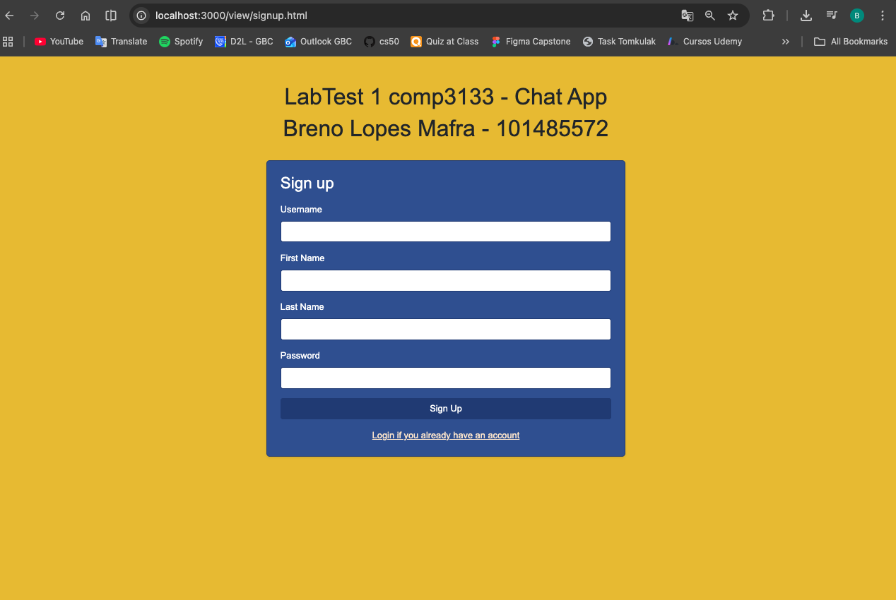
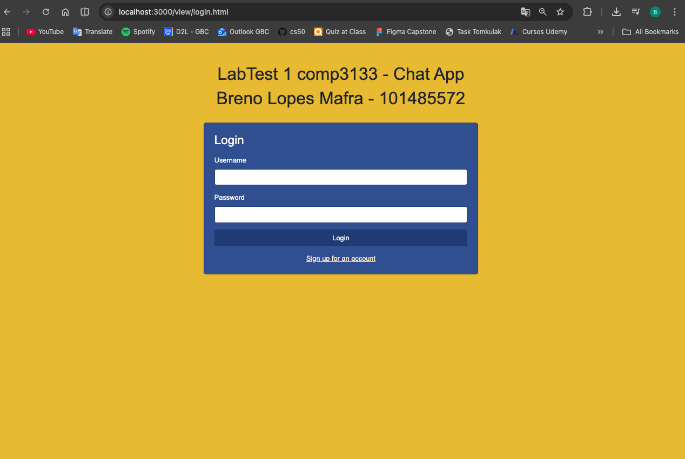
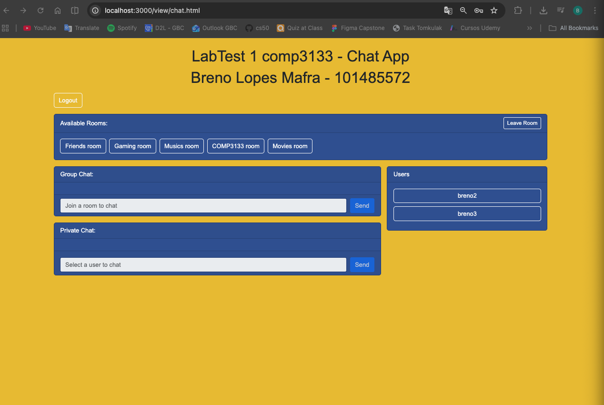
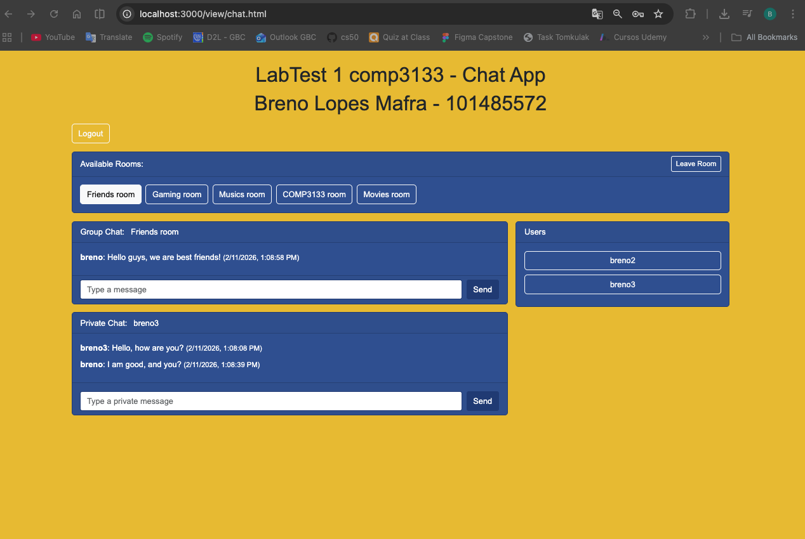

# LabTest 1 comp3133 - Chat App
# Breno Lopes Mafra - 101485572

## GitHub Repository Link:
https://github.com/brenolopesmafra/101485572_lab_test1_chat_app

## Tech Stack
- Backend: Node.js, Express, Socket.io, Mongoose
- Frontend: HTML5, CSS, Bootstrap, fetch, jQuery
- Database: MongoDB (local or Atlas)

## How to set .env file:
Local MongoDB:
```env
MONGO_URI=mongodb://127.0.0.1:27017/chat_app
```

MongoDB Atlas:
```env
MONGO_URI=mongodb+srv://<username>:<password>@<cluster>.mongodb.net/chat_app?retryWrites=true&w=majority&appName=<appName>
```

## How to install and run:
- npm install
- npm run dev

## How to use the application with screenshots:
### 1. First go to Signup screen to create a user.


### 2. After creating  user, go to Login page.


### 3. After logging in, you will be redirected to the main chat room.


### 4. Then you can select a room to join and start chatting with other users or select a user to start a private chat. See the following screenshot:

